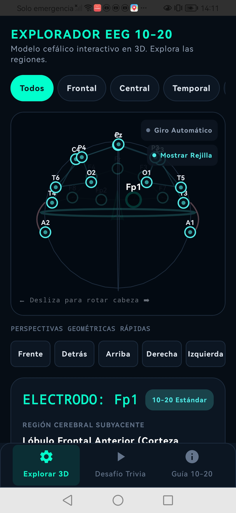

# 🧠 Movil EEG Simulator



## 📱 Aplicación Android para el Sistema Internacional EEG 10-20

Movil EEG Simulator es una aplicación educativa e interactiva para Android diseñada para facilitar el aprendizaje del Sistema Internacional 10-20 utilizado en Electroencefalografía (EEG).

La aplicación permite explorar visualmente la ubicación de los electrodos, conocer las regiones cerebrales asociadas y reforzar el aprendizaje mediante una experiencia interactiva optimizada para dispositivos móviles.

---

## 🚀 Características Principales

### 🧠 Explorador EEG 10-20

- Visualización interactiva de los electrodos EEG.
- Exploración anatómica de las regiones cerebrales.
- Identificación rápida de posiciones del sistema 10-20.
- Filtrado por regiones cerebrales.

### 🔄 Navegación Geométrica

- Vista frontal.
- Vista posterior.
- Vista superior.
- Vista lateral derecha.
- Vista lateral izquierda.

### 🎯 Información Educativa

- Descripción detallada de cada electrodo.
- Región cerebral subyacente.
- Funciones cognitivas asociadas.
- Aplicaciones clínicas y de investigación.

### 📚 Guía de Aprendizaje

- Explicación del Sistema Internacional EEG 10-20.
- Referencias anatómicas.
- Distribución de electrodos.
- Conceptos básicos de neurofisiología.

### 🎮 Modo Trivia

- Preguntas interactivas.
- Evaluación de conocimientos.
- Aprendizaje gamificado.
- Retroalimentación inmediata.

### 📱 Experiencia Móvil

- Interfaz moderna y responsiva.
- Optimizada para teléfonos Android.
- Navegación intuitiva.
- Diseño orientado a la educación.

---

## 📸 Captura de Pantalla


---

## 🏥 ¿Qué es el Sistema EEG 10-20?

El Sistema Internacional 10-20 es un estándar utilizado mundialmente para la colocación de electrodos durante estudios de electroencefalografía (EEG).

Su nombre proviene de las distancias relativas entre electrodos, calculadas utilizando intervalos del 10% y 20% sobre medidas específicas del cráneo.

Este sistema permite:

- Registrar actividad eléctrica cerebral.
- Diagnosticar trastornos neurológicos.
- Realizar investigaciones neurocientíficas.
- Desarrollar aplicaciones de interfaces cerebro-computadora (BCI).

---

## 🛠️ Tecnologías Utilizadas

### Desarrollo Móvil

- Android Studio
- Kotlin
- Android SDK

### Inteligencia Artificial

- Google Gemini API

### Diseño

- Material Design
- Jetpack Components

---

## 📂 Estructura General

```text
movil-eeg-simulator/
│
├── app/
├── gradle/
├── img-presentation.jpg
├── .env.example
├── build.gradle.kts
├── settings.gradle.kts
└── README.md
```

---

## ⚙️ Instalación

### Requisitos

- Android Studio Hedgehog o superior
- Android SDK actualizado
- Dispositivo Android o Emulador
- Clave API de Google Gemini

---

### 1. Clonar el repositorio

```bash
git clone https://github.com/23Juani/movil-eeg-simulator.git
```

### 2. Abrir en Android Studio

- Abrir Android Studio.
- Seleccionar **Open Project**.
- Elegir la carpeta del proyecto.

---

### 3. Configurar variables de entorno

Crear un archivo:

```text
.env
```

Agregar:

```env
GEMINI_API_KEY=TU_API_KEY
```

---

### 4. Sincronizar dependencias

Android Studio descargará automáticamente las dependencias necesarias.

---

### 5. Ejecutar la aplicación

Seleccionar:

```text
Run > Run app
```

o utilizar:

```text
Shift + F10
```

---

## 🎯 Objetivos Educativos

Esta aplicación busca:

- Facilitar el aprendizaje del Sistema EEG 10-20.
- Mejorar la comprensión anatómica cerebral.
- Apoyar la enseñanza de neurociencias.
- Servir como herramienta complementaria para estudiantes de medicina, ingeniería biomédica y neurociencia.

---

## 👨‍🎓 Público Objetivo

- Estudiantes de Medicina.
- Estudiantes de Ingeniería Biomédica.
- Estudiantes de Neurociencia.
- Técnicos en Neurofisiología.
- Investigadores.
- Profesionales de la salud.

---

## 🔬 Aplicaciones

- Enseñanza universitaria.
- Laboratorios de neurociencias.
- Formación clínica.
- Simulación educativa.
- Introducción a sistemas BCI.

---

## 🌐 Repositorio

### GitHub

:contentReference[oaicite:0]{index=0}

---

## 📄 Licencia

Este proyecto se distribuye con fines educativos y académicos.

---

## 👨‍💻 Autor

**Juan Tantani Patti**

- Desarrollador de Software
- Ingeniería de Sistemas
- Visualización Científica
- Tecnologías Educativas

---

## ⭐ Apoya el Proyecto

Si este proyecto te resulta útil:

- Dale una ⭐ en GitHub.
- Comparte el proyecto.
- Contribuye con mejoras.

---

**Movil EEG Simulator** busca acercar el aprendizaje de la electroencefalografía a estudiantes y profesionales mediante una experiencia móvil moderna, interactiva y accesible.
